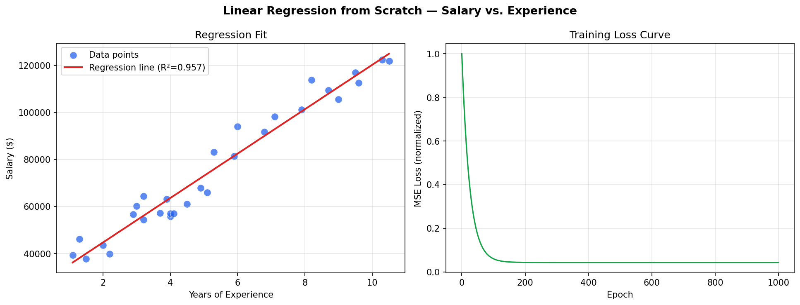

# Linear Regression from Scratch

Predicts salary from years of experience using gradient descent - no sklearn.

## What It Does
- Implements linear regression from scratch using only NumPy
- Normalizes features for stable gradient descent
- Computes R² score manually (achieved 0.957)
- Plots the regression line and training loss curve

## Run It
```bash
pip install -r requirements.txt
python linear_regression.py
```

## Output


## Stack
Python, NumPy, Pandas, Matplotlib